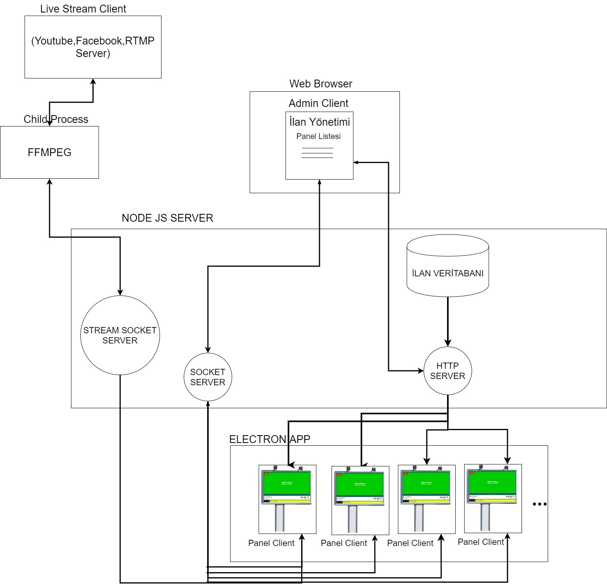
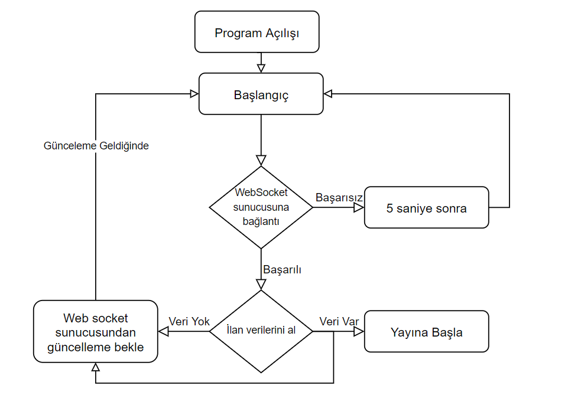
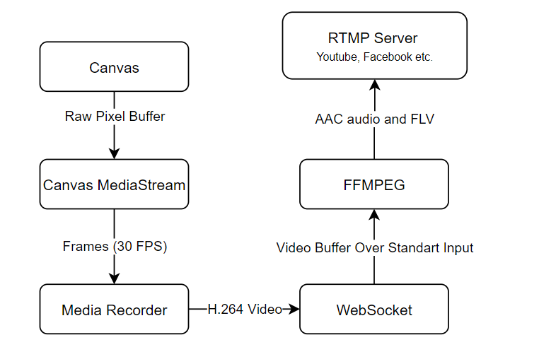
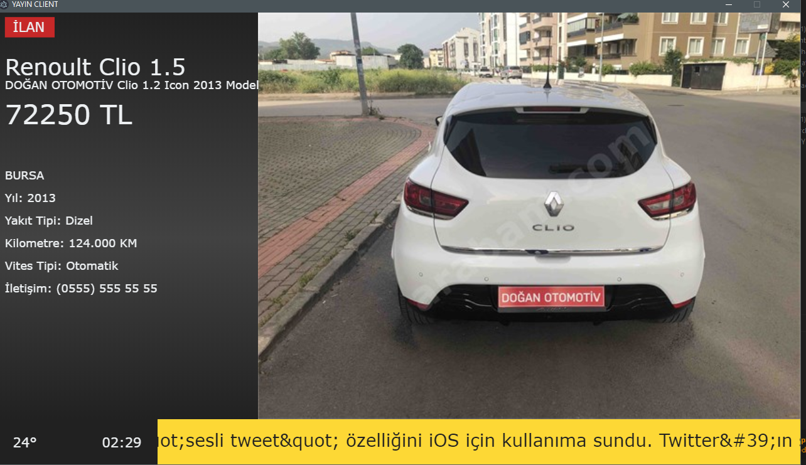
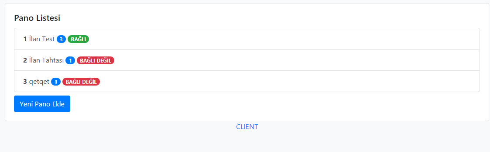
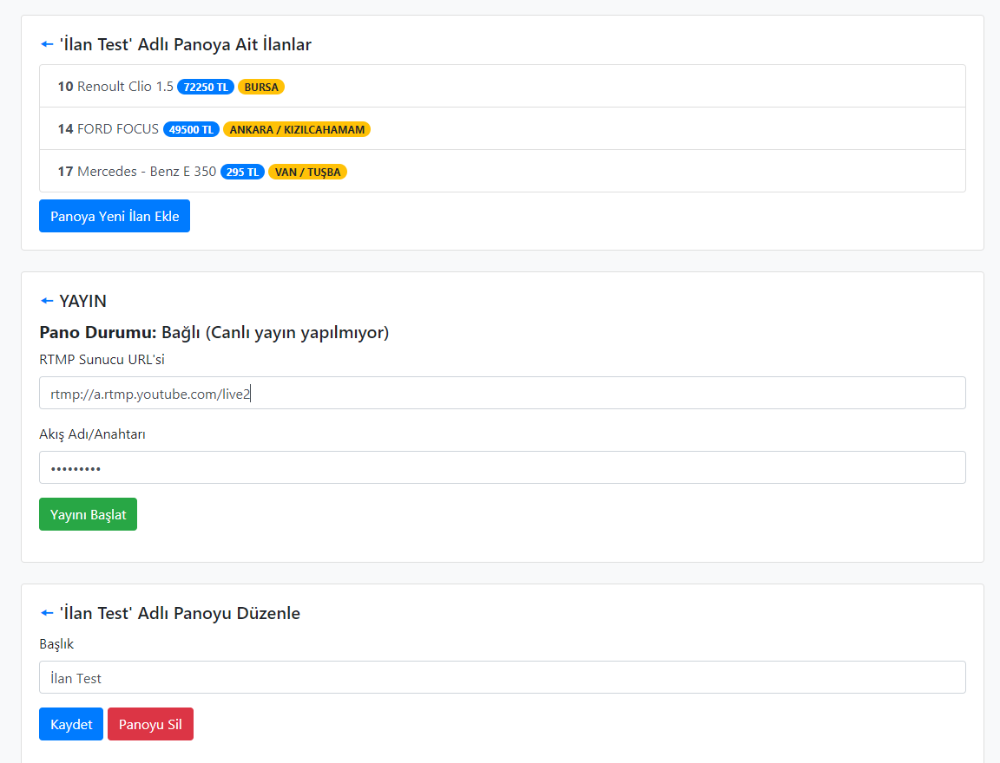
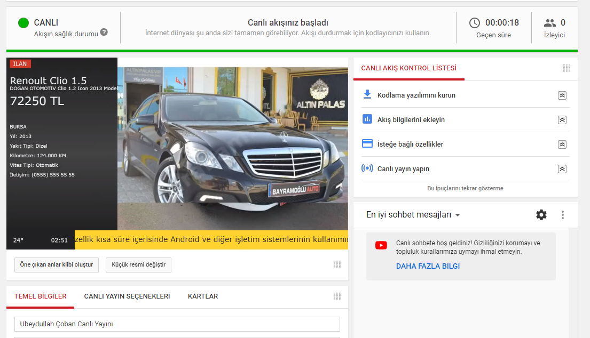

## İlan Sitelerine Yönelik Video Yayın Uygulaması

#### Özet

Projenin amacı sahibinden ve arabam gibi sitelerdeki ilanların bir ekran üzerinden yayınlanması ve bu yayınların bir panel üzerinden gerçek zamanlı olarak yönetilebilmesidir.

##### Proje Gereksinimleri

•	Kullanıcılar bir yönetim paneli üzerinden ilan panoları ekleyebilir ve düzenleyebilir.

•	Her ilan panosu ayrı bir uygulama çalıştırılarak ayrı ekranlar üzerinden yayınlanabilir.

•	Kullanıcılar bir panoya birden fazla ilan ekleyebilir.

•	Kullanıcılar bir ilana birden fazla resim veya video ekleyebilir. İlan yayınlanırken bu resim ve videolar slayt gösterisi şeklinde sırayla gösterilir.

•	Kullanıcılar bir ilana ait ekstra bilgiler ekleyebilir.

•	Kullanıcılar ilana ait bir bilgi eklediğinde, düzenlediğinde veya yeni bir ilan eklediğinde eğer pano yayındaysa yayın otomatik olarak güncellenir.
•	Kullanıcılar panoların anlık yayın yapıp yapmadığını ve bağlantı durumunu web paneli üzerinden görüntüleyebilir.

•	Kullanıcılar panel üzerinden gerekli bilgiler doldurarak bir çevrimiçi panoda yayınlanan ilanları youtube, facebook veya RTMP protokolünü destekleyen herhangi bir platformda canlı yayın yapabilir.

•	Kullanıcılar panel üzerinden bir RSS feed URL’i girebilir. Bu feed’den gelen bilgiler yayın sırasında alt kısımda kayan yazı olarak görüntülenir.

#### Proje Mimarisi

Bu proje temel olarak iki çalışan programdan oluşur. Biri NODE-JS(server), ikincisi ise ilanların gösterildiği electron uygulaması (client). Bu ilk iki program bağlı oldukları sunucular ile haberleşirler ve farklı ortamlarda çalışabilir.

Bir diğer uygulama ise üçüncü parti bir uygulama olan FFMPEG açık kaynak kodlu bir video converter yazılımıdır. NODE-JS tarafından gerektiğinde başlatılır.

 

##### 1.1	NODE JS (server)

###### 1.1.1	HTTP Sunucusu

Yönetim panelinin çalıştığı web sunucusudur.  Varsayılan olarak 3000 portunda çalışır. Bir web tarayıcı ile erişilebilir. Örneğin (http://localhost:3000/).
İlan bilgilerini panel üzerinden alıp veri tabanına kaydeder. Client istediğinde bilgileri client a gönderir.

###### 1.1.2	MYSQL Sunucusu

Çalışan sistemde kurulu olması gerekir. İlan bilgilerinin tutulduğu veri tabanıdır. Dört adet tablodan oluşur. Uygulama ilk çalıştığında bu tablolar otomatik oluşturulur.

###### 1.1.3	WebSocket Sunucu (Connection)

Bu sunucu client ile yönetim paneli arası gerçek zamanlı iletişimi sağlar. Bu sunucu sayesinde ilan güncellemeleri yapıldığında client’e haber verilir. Client’in sürekli bu sunucuya bağlı olması gerekir. Bu sayede bağlı olan clientler yönetim paneli üzerinden kontrol edilebilir.

###### 1.1.4	WebSocket Sunucu (Stream)

Canlı yayın sırasında client bu sunucuya bağlanır ve saniyede 30 kere oluşturduğu görüntüyü H.264 video şeklinde encode ederek sürekli gönderir.

##### 1.2	ELECTRON (client)

Gerçek yayın görüntüsünün oluştuğu web tabanlı programdır. Electron framework’ünü kullanır. Bu framework ise built-in olarak Chromium tarayıcısını içerir. İlan bilgilerini http sunucusundan alır ve yayın görüntüsünü oluşturmak için Web Canvas Api kullanır. 

Client çalışma akışı şekildeki gibidir
 
  

##### 1.3	FFMPEG

FFMPEG uygulaması sadece canlı yayın sırasında çalışır. Client üzerinden gelen videoyu WebSocket üzerinden alarak diğer canlı yayın uygulamaların (youtube gibi) anladığı RMTP formatına dönüştürür ve gönderir.
FFMPEG uygulaması canlı yayın başlatıldığında node-js server tarafından bir alt program olarak fork edilerek çalıştırılır ve canlı yayın kesildiğinde kapanır.

##### 1.4	Canlı Yayın Akışı
 

#### Konfigürasyon Dosyası

Projenin parametreleri .env dosyasında saklanır. Değerlerin açıklaması ve varsayılan değerleri aşağıdaki gibi belirlenmiştir. Bu parametreler server başlatılırken komut satırı üzerinden de verilebilir.

**FFMPEG_PATH=bin\ffmpeg**
FFMPEG program yolu

**HTTP_PORT=3000** 
Http Sunucu Portu

**CONNECTION_WEBSOCKET_PORT=3001** 
Bağlantı Kontrolü Sunucu Portu

**STREAM_WEBSOCKET_PORT=3005**
Yayın Sunucu Portu

**DB_HOST=localhost 
DB_USER=root
DB_PASSWORD= 
DB_DATABASE=ilan 
DB_TIMEZONE=UTC+3**

Mysql Sunucu Bilgileri

#### Proje Çıktısı
 
 
 
 
 

 

